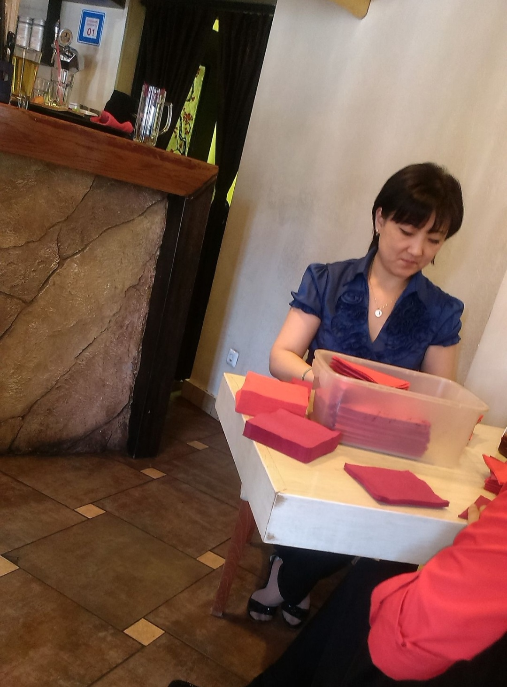

# **Моя мудрая тётя Лена**

В мои студенческие годы ,
 когда я работала официантом в *японском ресторане*, работала у нас прекрасная **Елена**.
 
  Она была администратором. Она была настолько
 * душевна 
 * эмпатична 
 * женственна
 * ухоженна

 и чувствовалось в ней глубокое познание жизни,в ней было столько мудрости и мягкой женской силы.

 Любые сложности и по работе, и в личной жизни я могла доверить ей. 

 *Однажды* я встретила свою **первую любовь**.
  Я была молода и наивна.

 Вкусив вкус любви , почувствовав, что это за чувство, я была уже в другом
 измерении. В другом мире,в другой вселенной. 

 Я всю свою *"Love Story"* рассказывала тёте Лене без остатков.

 Она слушала меня внимательно ,радовалась за меня. Давала мне советы женские.

 Она каждый день видела моего молодого человека,т.к. тот каждый день забирал меня с работы.

 *Спустя несколько месяцев*, она мне сказала 
 > "В молодости встречайся с такими парнями
 > (Тусовщиками),
 > гуляй,тусуйся,но выходи замуж за спокойного,
 > домoседа-трудоголика.Твой не подходит для 
 > создании семьи".

 Тогда я очень задумалась и положила в свою копилку её слова.

 *Спустя пару лет*, я всё таки поняла , что она была чертовски права и я послушалась её совета.

 Теперь я глубоко благодарна ей за наставления.
 Очень счастлива и удовлетворена своей жизнью.
 Хотелось бы найти её, поблагодарить,но незнаю ни фамилии,ни адреса.
